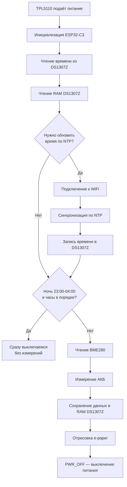
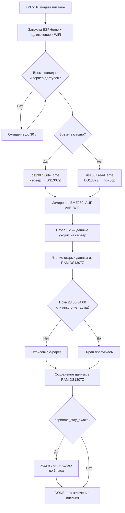

# ⚙️ ClimaticDisplay 2.66G — алгоритм работы

> **Навигация:** [← На главную](../ReadMe.md) · [📄 Описание прибора](DeviceDescription.md)

Документ описывает обе прошивки прибора:

- [Часть 1. Arduino-версия (рабочий прибор)](#часть-1-arduino-версия-рабочий-прибор)
- [Часть 2. ESPHome-версия (домашний прибор)](#часть-2-esphome-версия-домашний-прибор)

---

# Часть 1. Arduino-версия (рабочий прибор)

## Общая идея

Прибор не работает постоянно. Таймер **TPL5110** раз в 20 минут подаёт питание на схему, **ESP32-C3** просыпается, делает замер, обновляет экран и сам себя выключает. Поэтому весь код программы размещён в `setup()`, а `loop()` пуст.

Ночью (с 23:00 до 04:00) прибор экономит заряд АКБ: он синхронизирует время по NTP (если это нужно) и сразу выключается — без измерений и обновления экрана.

---

## Пошаговый алгоритм

### Шаг 1. Чтение времени из DS1307Z

1. Проверка наличия МС на линии I2C (чтение регистра дня недели);
   - нет ответа → бит ошибки `DS1307Z`;
2. Чтение даты и времени (8 регистров, BCD);
3. Проверка актуальности: если год < 26 — часы были сброшены → бит `TimeRST`.

### Шаг 2. Чтение RAM DS1307Z

Читаются 8 байт RAM — прошлые показания (`AllDataOld`) для стрелок ↑/↓ и биты ошибок прошлого цикла.

### Шаг 3. Синхронизация времени по NTP

Условия обновления времени:

| Версия прошивки | Условие |
|---|---|
| Домашняя (`VER_FOR_HOME`) | 00:00–00:20 |
| Рабочая (по умолчанию) | 10:00–10:20 в будние дни |
| Любая | время было сброшено (`TimeRST`), или в прошлый раз не удалось подключиться к WiFi/NTP |

Порядок действий:

1. Подключение к WiFi (таймаут ~30 с) → при неудаче бит `WiFi`;
2. Запрос времени у NTP-сервера (таймаут ~30 с) → при неудаче бит `NTP`;
3. Перевод времени в BCD и запись в DS1307Z;
4. Отключение WiFi и переход модуля в `WIFI_OFF` — экономия энергии.

### Шаг 4. Ночной режим экономии АКБ

После синхронизации проверяется текущее время:

- если МС ответила, время актуально и сейчас **23:00–04:00** — прибор **сразу выключается**: измерения и обновление экрана пропускаются;
- если время было сброшено (`TimeRST`) или МС не ответила — не спим, а работаем дальше (покажем ошибку или данные).

Интервал настраивается макросами `NIGHT_START_HOUR` / `NIGHT_END_HOUR` (формат BCD).

### Шаг 5. Чтение датчика BME280

1. Датчик переводится в принудительный режим (`FORCED_MODE`) — одно измерение за включение, экономия энергии;
2. Если датчик не ответил — выставляется бит ошибки `BME280`;
3. Считываются температура и влажность (×10), давление пересчитывается в мм рт. ст. (×10).

### Шаг 6. Измерение напряжения АКБ

1. Читается канал АЦП (пин A0) через `analogReadMilliVolts()` — точнее, чем `analogRead()`;
2. Значение пересчитывается в напряжение АКБ (с учётом делителя);
3. Если напряжение ниже порога — бит ошибки `Battery`.

### Шаг 7. Сохранение данных в RAM DS1307Z

Текущие показания датчиков (8 байт структуры `AllData_t`) записываются в RAM микросхемы часов. При следующем включении они станут «старыми» и позволят нарисовать стрелки ↑/↓ изменения.

### Шаг 8. Отрисовка экрана

1. Инициализация GxEPD2, поворот на 90° (`setRotation(1)`), заливка белым;
2. Верхний колонтитул: жёлтая плашка со временем последнего обновления;
3. Три окна: температура (с градусником, окрашенным по диапазону), влажность, давление (иконка по диапазону);
4. Стрелки ↑/↓ — сравнение с прошлыми показаниями из RAM;
5. Нижний колонтитул: ошибки (или «Удачного дня!!!») + значок и напряжение АКБ;
6. `display()` — вывод картинки, `hibernate()` — перевод экрана в режим сна.

### Шаг 9. Выключение питания

Пин `PWR_OFF` (D10) переводится в высокий уровень — сигнал **DONE** для TPL5110, который снимает питание со всей схемы до следующего цикла.

---

## Отладочные макросы прошивки

| Макрос | Назначение |
|---|---|
| `DEBUG` | Вывод отладочной информации в Serial (115200) |
| `NO_BME280` | Отключить работу с BME280 |
| `NO_DS1307` | Отключить работу с DS1307 |
| `NO_GxEPD2` | Отключить работу с экраном |
| `VER_FOR_HOME` | Домашняя версия: обновление времени ночью |
| `POWER_AKB_32V` | Питание от LiFePO4 3,2 В (включено по умолчанию) |
| `POWER_AKB_42V` | Питание от LiPo 4,2 В |
| `NIGHT_START_HOUR` | Начало ночного режима: 23:00 (в формате BCD) |
| `NIGHT_END_HOUR` | Конец ночного режима: 04:00 (в формате BCD) |

---

# Часть 2. ESPHome-версия (домашний прибор)

> Конфигурация: `ForESPHome/RoomClimatic.yaml` (компилируется на сервере Home Assistant).

## Общая идея

Принцип тот же: TPL5110 включает прибор каждые 20 минут, ESP32-C3 загружается, выполняет сценарий `Execute_and_off` (запускается автоматически после загрузки) и подаёт сигнал DONE на выключение. Отличия от Arduino-версии:

- прибор всегда подключается к WiFi и Home Assistant, чтобы **передать данные датчиков** — в том числе ночью и когда дома никого нет;
- время приходит с сервера Home Assistant; при недоступности сервера используется время из DS1307Z (автономный режим);
- экран обновляется не каждое включение: ночью (23:00–04:00) и при отсутствии людей дома (`input_boolean.people_at_home = off`) отрисовка пропускается ради экономии АКБ;
- режим обновления прошивки (`input_boolean.esphome_stay_awake = on`) удерживает прибор включённым до OTA-обновления, но не более 1 часа.

## Пошаговый алгоритм сценария `Execute_and_off`

### Шаг 1. Ожидание сервера и времени

После загрузки ждём 10 секунд (подключение к WiFi), затем сценарий проверяет условие «время валидно и сервер доступен» и ждёт его до 30 секунд:

- если сервер доступен — время синхронизируется с Home Assistant (платформа `homeassistant`, интервал 10 с — чтобы успеть за короткое включение);
- если сервер недоступен — продолжаем без него (автономный режим).

### Шаг 2. Синхронизация часов DS1307Z

- время валидно (есть сервер) → действие `ds1307.write_time` записывает время сервера в МС — часы остаются точными для будущих автономных включений;
- время невалидно (нет сервера) → действие `ds1307.read_time` берёт время из МС — прибор работает без сети.

### Шаг 3. Измерение датчиков

Действиями `component.update` принудительно измеряются BME280 (температура, влажность, давление → мм рт. ст.), напряжение АКБ (АЦП) и уровень WiFi. После 3-секундной паузы значения гарантированно переданы на сервер — **даже ночью и когда никого нет дома**.

### Шаг 4. Чтение старых данных из RAM DS1307Z

Из RAM DS1307Z (адреса 0x08–0x0F) читаются прошлые показания в том же формате, что и в Arduino-версии (`AllData_t`), — для стрелок ↑/↓. Если значения не проходят проверку на адекватность, стрелки не рисуются.

### Шаг 5. Решение об обновлении экрана

Экран обновляется, только если одновременно:

- сейчас **не ночь** (23:00–04:00, проверяется по часам с проверкой года — защита от мусорного времени МС);
- **кто-то есть дома** (`input_boolean.people_at_home = on`; флагу доверяем только при доступном сервере — иначе прибор не отличит «никого нет» от «нет связи»);

иначе отрисовка пропускается — экономия АКБ.

### Шаг 6. Отрисовка экрана

Картинка та же, что в Arduino-версии: колонтитулы, три окна с иконками по диапазону значений, стрелки ↑/↓, строка ошибок и значок АКБ. Отличия:

- драйвер дисплея — внешний компонент `gdey0266f51h` (порт GxEPD2): то же разрешение, те же 4 цвета;
- шрифты — **FreeSans Bold** (`fonts/FreeSansBold.ttf`, GNU FreeFont) в тех же размерах, что в Arduino-версии: 48px (24pt), 20px (10pt) и 16px (8pt) — картинка выглядит так же;
- иконки — BMP-файлы, сконвертированные из `ESP32-C3/img` скриптом `ForESPHome/tools/convert_icons.py`;
- при взведённом `esphome_stay_awake` в строке ошибок выводится `|OTA|`.

### Шаг 7. Сохранение данных в RAM DS1307Z

Текущие показания записываются в RAM МС (если BME280 исправен) — в следующем включении они станут «старыми» для стрелок ↑/↓. Запись выполняется независимо от того, обновлялся ли экран.

### Шаг 8. Выключение питания

- `esphome_stay_awake = off` → переключатель `Done_Out` подаёт высокий уровень на GPIO10 (DONE для TPL5110) — питание снимается;
- `esphome_stay_awake = on` → сценарий ждёт снятия флага (до 1 часа — защита), затем выключает питание. Пока флаг взведён, можно выполнить OTA-обновление.

## Индикация ошибок (ESPHome-версия)

Битовых флагов в RAM нет — строка ошибок формируется на лету по состоянию датчиков:

| Код | Значение |
|---|---|
| `\|TM\|` | время не синхронизировано (нет сервера и МС) |
| `\|BME\|` | BME280 не отвечает |
| `\|Bt\|` | напряжение АКБ < 2,5 В |
| `\|WF\|` | нет соединения с сервером Home Assistant |
| `\|OTA\|` | взведён режим ожидания прошивки |

Если ошибок нет — «Удачного дня!!!».

## Соответствие режимов и объектов Home Assistant

| Объект | Назначение |
|---|---|
| `input_boolean.people_at_home` | «Дома кто-то есть»: off — экран не обновляется |
| `input_boolean.esphome_stay_awake` | «Обновление прошивки»: on — прибор не выключается (OTA) |
| Датчики `roomclimatic.*` | Температура, влажность, давление (гПа и мм рт. ст.), напряжение АКБ, уровень WiFi |

---

## Навигация

[← На главную](../ReadMe.md) · [📄 Описание прибора](DeviceDescription.md)
