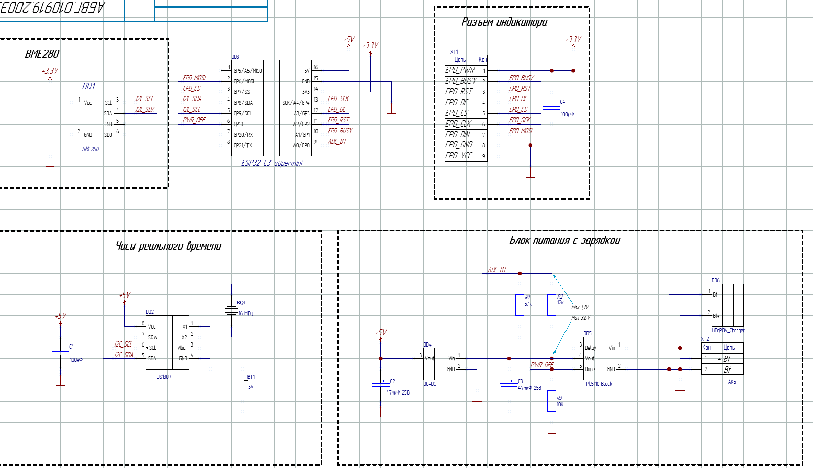
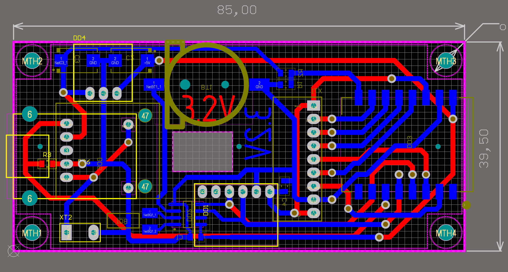
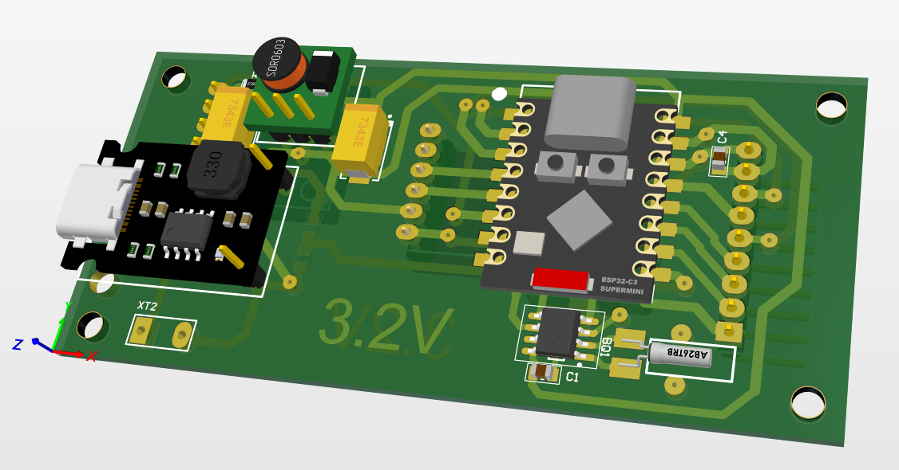
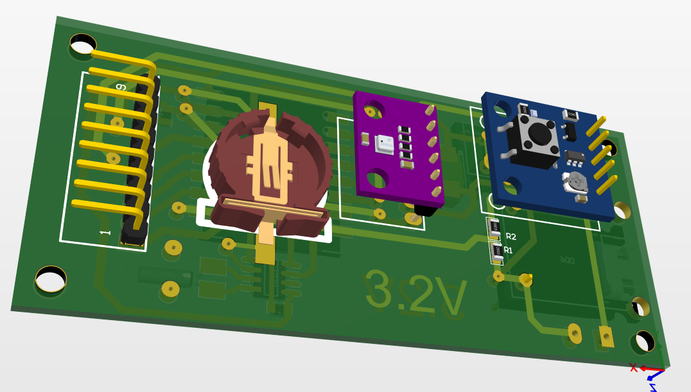
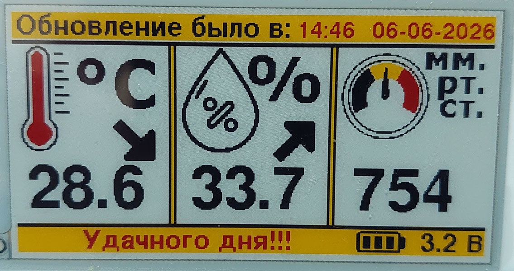
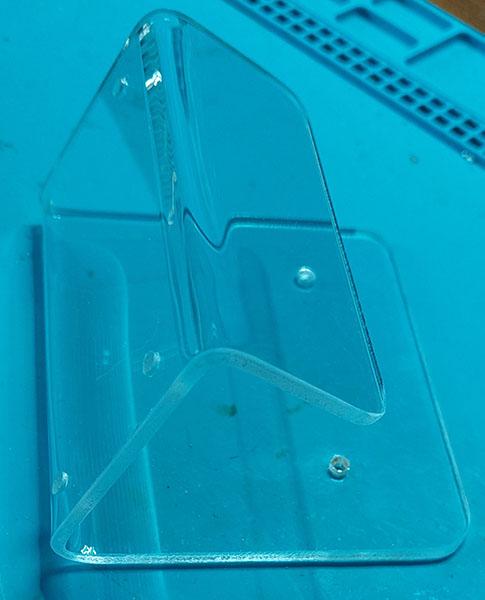

# 📄 ClimaticDisplay 2.66G — описание прибора

> **Навигация:** [← На главную](../ReadMe.md) · [⚙️ Алгоритм работы](Algorithm.md)

---

## Назначение

Автономный настенный климатический модуль для отображения температуры, влажности и атмосферного давления. Прибор не работает постоянно: таймер **TPL5110** раз в 20 минут подаёт питание, **ESP32-C3** проводит измерение, обновляет картинку на экране и отключает питание. Благодаря e-paper дисплею картинка остаётся видимой без потребления энергии.

---

## Технические характеристики

| Параметр | Значение |
|---|---|
| Микроконтроллер | ESP32-C3 (RISC-V, WiFi) |
| Дисплей | 2.66" e-paper, 4 цвета: чёрный, белый, красный, жёлтый; 360×184 px |
| Датчик | BME280: температура, влажность, атмосферное давление |
| Часы | DS1307Z (I2C) с кварцем и резервной батарейкой |
| Питание | 2 × LiFePO4 1,3 А·ч (≈3,2 В) + модуль зарядки |
| Управление питанием | TPL5110 — включение каждые 20 минут; ночью (23:00–04:00) и при отсутствии людей дома экран не обновляется — экономия АКБ |
| Потребление | только в момент измерения и отрисовки (секунды) |

---

## Структурная схема

```mermaid
flowchart TD
    BME[BME280 датчик] -->|I2C| ESP[ESP32-C3]
    RTC[DS1307Z часы] -->|I2C| ESP
    AKB[АКБ LiFePO4] -->|делитель, АЦП A0| ESP
    TPL[TPL5110 таймер] -->|подаёт питание| ESP
    ESP -->|SPI| EPD[E-paper 2.66"]
    ESP -->|DONE, D10| TPL
```

---

## Описание узлов

### ESP32-C3 Super Mini
Микроконтроллерный модуль на базе ESP32-C3. Выполняет весь алгоритм: опрос датчиков, синхронизацию времени по NTP, отрисовку экрана и управление питанием.

### Дисплей 2.66" e-Paper (G), Waveshare
Четырёхцветный графический дисплей на электронных чернилах (GDEY0266F51H), 184×360 px (в проекте повёрнут на 90° — 360×184). Подключение по SPI. Картинка сохраняется без питания, поэтому используется полная перерисовка один раз за цикл. Работает через библиотеку **GxEPD2**.

### BME280
Датчик температуры, влажности и атмосферного давления. Подключён по I2C, работает в принудительном режиме (FORCED): по одному измерению за включение — так экономится энергия.

### DS1307Z
Микросхема часов реального времени (I2C) с кварцем и резервной батарейкой — время не сбрасывается при отключении основного питания. Помимо часов, имеет **56 байт RAM**: в них хранятся показания прошлого измерения и биты ошибок, чтобы при следующем включении нарисовать стрелки ↑/↓ и сохранить историю сбоев. Этот механизм используют обе прошивки (формат `AllData_t` совместим: переход между Arduino и ESPHome не ломает стрелки ↑/↓).

### TPL5110
Микромощный таймер, управляющий питанием всей схемы: каждые 20 минут замыкает питание. ESP32-C3 по окончании работы подаёт сигнал **DONE** (пин D10) — TPL5110 снимает питание до следующего цикла.

**Пример схемы включения TPL5110:**


Экономия АКБ реализована по-разному в двух прошивках:

- **Arduino-версия**: ночью (23:00–04:00) после чтения времени и синхронизации (при необходимости) прибор подаёт DONE сразу — измерения и обновление экрана пропускаются;
- **ESPHome-версия**: данные всегда измеряются и передаются на сервер, но экран не обновляется ночью (23:00–04:00) и когда дома никого нет (`input_boolean.people_at_home = off`); в режиме обновления прошивки (`input_boolean.esphome_stay_awake = on`) DONE не подаётся до снятия флага (максимум 1 час) — это позволяет выполнить OTA.

### Питание
Два аккумулятора **LiFePO4** по 1,3 А·ч (номинал ≈3,2 В) и модуль зарядного устройства. Уровень заряда контролируется через АЦП (пин A0). При разряде АКБ на экран выводится соответствующая ошибка.

---

## Распиновка ESP32-C3 Super Mini

| Интерфейс | Назначение | Пин |
|---|---|---|
| **SPI** (дисплей) | SCK | D4 |
| | MOSI | D6 |
| | CS | D7 |
| | RST | D2 |
| | DC | D3 |
| | BUSY | D1 |
| | PWR | жёстко подтянут к VCC |
| **I2C** (BME280 + DS1307) | SDA | D8 |
| | SCL | D9 |
| **АЦП** (заряд АКБ) | A0 | D0 |
| **Питание** | PWR_OFF (TPL5110) | D10 |

---

## Компоновка экрана

Экран 360×184 px состоит из трёх окон и двух колонтитулов:

| Зона | Координаты (x, y, ширина, высота) | Содержимое |
|---|---|---|
| Верхний колонтитул | (0, 0, 360, 20) — жёлтый | «Обновление было в: ЧЧ:ММ ДД-ММ-ГГГГ» |
| Разделитель | (0, 21, 360, 3) — чёрный | — |
| Окно температуры | иконка (1, 25, 112, 80) · стрелка (74, 80, 32, 32) · значение (8, 148) | градусник, ↑/↓, значение °C |
| Разделитель 1 | (116, 24, 2, 137) чёрный · (118, 24, 3, 137) жёлтый · (120, 24, 2, 137) чёрный | — |
| Окно влажности | иконка (123, 25, 112, 80) · стрелка (196, 80, 32, 32) · значение (132, 148) | капля, ↑/↓, значение % |
| Разделитель 2 | (238, 24, 2, 137) чёрный · (240, 24, 3, 137) жёлтый · (242, 24, 2, 137) чёрный | — |
| Окно давления | иконка (245, 25, 112, 80) · стрелка (317, 80, 32, 32) · значение (257, 148) | барометр, ↑/↓, значение мм рт. ст. |
| Нижний разделитель | (0, 161, 360, 3) — чёрный | — |
| Нижний колонтитул | (0, 164, 360, 20) — жёлтый | ошибки слева, значок АКБ (260, 165, 40, 18) и напряжение (310, 180) справа |

---

## Индикация ошибок

Ошибки хранятся в виде битовой маски (2 байта) в RAM DS1307Z и выводятся в нижнем колонтитуле экрана:

| Бит | Обозначение | На экране | Значение |
|---|---|---|---|
| 0 | DS1307Z | `\|TM\|` | МС часов реального времени не отвечает |
| 1 | BME280 | `\|BME\|` | Датчик BME280 не отвечает |
| 2 | Battery | `\|Bt\|` | АКБ разряжен |
| 3 | WiFi | `\|WF\|` | Нет подключения к WiFi |
| 4 | NTP | `\|NTP\|` | Нет ответа от сервера времени |
| 5 | TimeRST | `\|TM_Rst\|` | Время часовой МС было сброшено |
| 6–15 | — | — | Резерв |

Если ошибок нет — в нижнем колонтитуле выводится «Удачного дня!!!».

> В ESPHome-версии ошибки не хранятся в RAM, а формируются на лету по состоянию датчиков: `|TM|` — нет времени, `|BME|` — датчик не отвечает, `|Bt|` — АКБ < 2,5 В, `|WF|` — нет связи с сервером, `|OTA|` — режим ожидания прошивки. Подробнее: [⚙️ Алгоритм работы](Algorithm.md).

---

## Конструкция

- **Корпус** — модель в FreeCAD (`CAD/Корпус.FCStd`), печать/фрезеровка;
- **Плата** — разработана в Altium Designer (`Altium/`), смотри фото ниже.

| Фото | Описание |
|---|---|
|  | Принципиальная схема |
|  | Разведённая плата |
|  | 3D-модель платы, вид сверху |
|  | 3D-модель платы, вид снизу |
|  | Экран устройства |
|  | Корпус |

---

## Навигация

[← На главную](../ReadMe.md) · [⚙️ Алгоритм работы](Algorithm.md)
