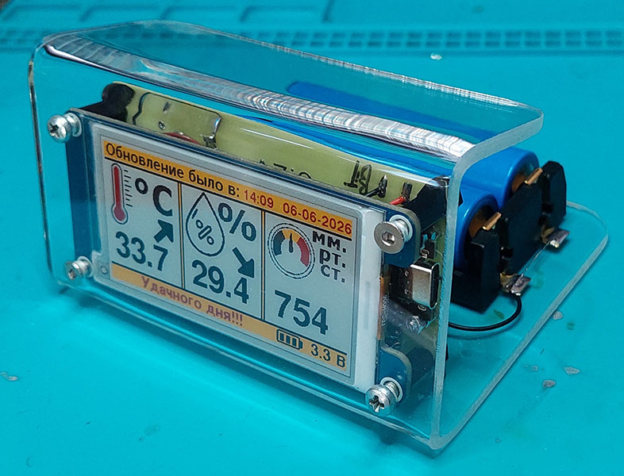
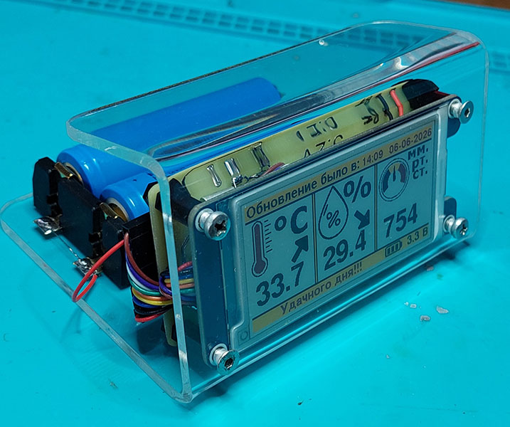
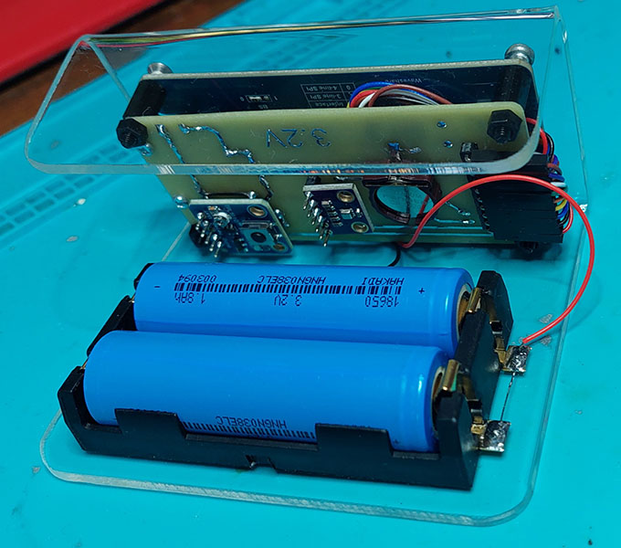

# 🌡 ClimaticDisplay 2.66G

> **Климатический модуль с 4-цветным графическим экраном на электронных чернилах.**

Автономный настенный прибор на базе **ESP32-C3**: измеряет температуру, влажность и атмосферное давление, раз в 20 минут просыпается по таймеру, рисует свежие данные на e-paper дисплее и снова отключает питание. Работает от пары LiFePO4 аккумуляторов.

Существует в двух вариантах с одинаковым железом, но разным ПО:

| Вариант | Прошивка | Где стоит | Обмен данными |
|---|---|---|---|
| **Рабочий** | Arduino (`ESP32-C3/`) | На работе | Автономный, без сервера |
| **Домашний** | ESPHome (`ForESPHome/`) | Дома | Интеграция с Home Assistant |

---

## 🧭 Навигация по проекту

| Документ | Описание |
|---|---|
| [📄 Описание прибора](DOC/DeviceDescription.md) | Железо, характеристики, конструкция, распиновка |
| [⚙️ Алгоритм работы](DOC/Algorithm.md) | Пошаговый алгоритм обеих прошивок (Arduino и ESPHome) с блок-схемами |

---

## 📷 Фотографии

**Экран**

**Вид сбоку**

| Справа | Слева |
|---|---|
|  |  |

**Вид сзади**

**Корпус**

**Схема и плата**

| Схема | Разведённая плата |
|---|---|
|  |  |

| 3D модель, вид сверху | 3D модель, вид снизу |
|---|---|
|  |  |

---

## 🖥 Что выводится на дисплей

1. 🌡 **Температура** + значок изменения (↑ / ↓);
2. 💧 **Влажность** + значок изменения;
3. 🌀 **Атмосферное давление** + значок изменения;
4. 🕒 **Время последнего обновления** (дата, время);
5. ⚠ **Ошибки** (если есть): соединение с сервером, общение с датчиками и часами;
6. 🔋 **Значок и напряжение заряда АКБ**.

---

## 🧰 Железо

| № | Компонент | Назначение |
|---|---|---|
| 1 | **ESP32-C3 Super Mini** | Микроконтроллерный модуль |
| 2 | **2.66" e-Paper Module (G), Waveshare** | 4-цветный графический дисплей 360×184 px |
| 3 | **BME280** | Датчик температуры, влажности и атмосферного давления |
| 4 | **DS1307Z** | Часы реального времени (кварц + батарейка) |
| 5 | **TPL5110** | Таймер включения прибора (каждые 20 минут) |
| 6 | **LiFePO4 ×2** | Аккумуляторы по 1,3 А·ч |
| 7 | **Модуль зарядки** | Зарядное устройство для АКБ |

---

## 💾 Прошивки

### 🧑‍💻 Arduino (рабочая версия) — `ESP32-C3/`

Полностью автономная прошивка: время синхронизируется по NTP через WiFi (по будням в 10:00), данные для стрелок ↑/↓ и биты ошибок хранятся в RAM DS1307Z. Ночью (23:00–04:00) прибор сразу выключается, экономя заряд АКБ.

### 🏠 ESPHome (домашняя версия) — `ForESPHome/`

Прошивка компилируется на сервере Home Assistant (файл `RoomClimatic.yaml`). Отличия от Arduino-версии:

- измеренные данные (температура, влажность, давление, напряжение АКБ, уровень WiFi) передаются в Home Assistant **при каждом включении, даже ночью**;
- время берётся с сервера Home Assistant, а при недоступности сервера — из DS1307Z; синхронизация DS1307Z — в обе стороны;
- экран не обновляется ночью (23:00–04:00) и когда **дома никого нет** (`input_boolean.people_at_home`) — экономия АКБ;
- режим **«обновление прошивки»** (`input_boolean.esphome_stay_awake`): прибор не выключается, пока флаг взведён (для OTA), максимум 1 час;
- стрелки ↑/↓ работают так же, как в Arduino-версии: прошлые показания хранятся в RAM DS1307Z;
- драйвер 4-цветного дисплея — внешний компонент `ForESPHome/components/gdey0266f51h` (портирован из GxEPD2), иконки конвертируются из Arduino-версии скриптом `ForESPHome/tools/convert_icons.py`.

> Для загрузки на сервер в папку `ForESPHome/` нужно положить файл шрифта `fonts/FreeSansBold.ttf` (GNU FreeFont — тот же шрифт, что используется в Arduino-версии), а также `secrets.yaml` с ключами `wifi_ssid` и `wifi_password` (на сервере они уже есть).

---

## 🔌 Порты модуля ESP32-C3 Super Mini

| Интерфейс | Назначение | Пин |
|---|---|---|
| **SPI** (дисплей) | SCK | D4 |
| | MOSI | D6 |
| | CS | D7 |
| | RST | D2 |
| | DC | D3 |
| | BUSY | D1 |
| | PWR | жёстко подтянут к VCC |
| **I2C** (BME280 + DS1307) | SDA | D8 |
| | SCL | D9 |
| **АЦП** (заряд АКБ) | A0 | D0 |
| **Питание** | PWR_OFF (TPL5110) | D10 |

---

## ⚙️ Алгоритм работы Arduino-версии (кратко)

Модуль **TPL5110** каждые 20 минут подаёт питание на схему. ESP32-C3 включается и выполняет:

1. Читает время и RAM из **DS1307Z**;
2. При необходимости синхронизирует время по **NTP** через WiFi (домашняя версия — ночью, рабочая — в 10:00 по будням, либо после прошлого сбоя);
3. Ночью (23:00–04:00) сразу выключается — экономия АКБ;
4. Настраивает и считывает данные из **BME280**;
5. Измеряет канал АЦП и пересчитывает его в напряжение **АКБ**;
6. Записывает данные в RAM **DS1307Z** — для показа ↑/↓ при следующем включении;
7. Формирует изображение и выводит его на **e-paper** дисплей;
8. Подаёт сигнал **TPL5110** на выключение питания.

Подробности и блок-схемы обеих версий (Arduino и ESPHome): [⚙️ Алгоритм работы](DOC/Algorithm.md)

---

## 🛠 ПО для разработки

| Что | Чем |
|---|---|
| Схема и плата | **Altium Designer 24.3.1** (компоненты из библиотеки автора — репозиторий `AltiumDesignerLibrary`) |
| Прошивка (Arduino) | **Arduino** для ESP32-C3, кодировка текстов **UTF-8** |
| Прошивка (ESPHome) | **ESPHome** (компилируется на сервере Home Assistant) |
| Корпус | **FreeCAD** |

> **ГОСТ шрифт:** для правильного отображения шрифта в Altium Designer необходимо установить в систему шрифт `Altium GOST Type A.ttf` из корня репозитория.

---

## 📚 Используемые библиотеки

| Библиотека | Для чего |
|---|---|
| [**GyverBME280**](https://github.com/GyverLibs/GyverBME280) | Датчик BME280 (Arduino-версия) |
| **DS1307** (`DS1307.h` / `DS1307.cpp`) | Собственная библиотека часов реального времени (Arduino-версия) |
| [**GxEPD2**](https://github.com/ZinggJM/GxEPD2) | Графический e-paper дисплей (Arduino-версия) |
| [**ESPHome**](https://esphome.io/) | Вся прошивка домашней версии (`ForESPHome/RoomClimatic.yaml`) |

---

## 📖 Документация

- [📄 Описание прибора](DOC/DeviceDescription.md)
- [⚙️ Алгоритм работы](DOC/Algorithm.md)
- [🙏 Благодарности и лицензии](CREDITS.md)

---

## 📜 Лицензия

Код, конфигурации, CAD-модели и документация — **MIT** (см. [LICENSE](LICENSE)): можно свободно
использовать, изменять и распространять, сохранив упоминание авторства.

Исключение — производные от GPL-компонентов: драйвер дисплея
`ForESPHome/components/gdey0266f51h/` (порт **GxEPD2**) распространяется под **GPL-3.0**,
шрифты — **GNU FreeFont** (GPL-3.0+ с Font Exception). Подробности и список сторонних
проектов: [🙏 Благодарности и лицензии](CREDITS.md).

---

👨‍💻 **Разработчик: Кабанов Алексей, 2026 г.**
